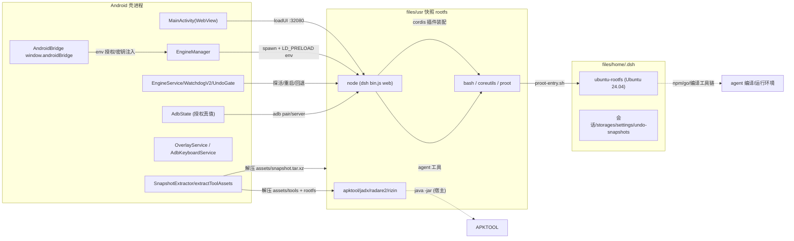
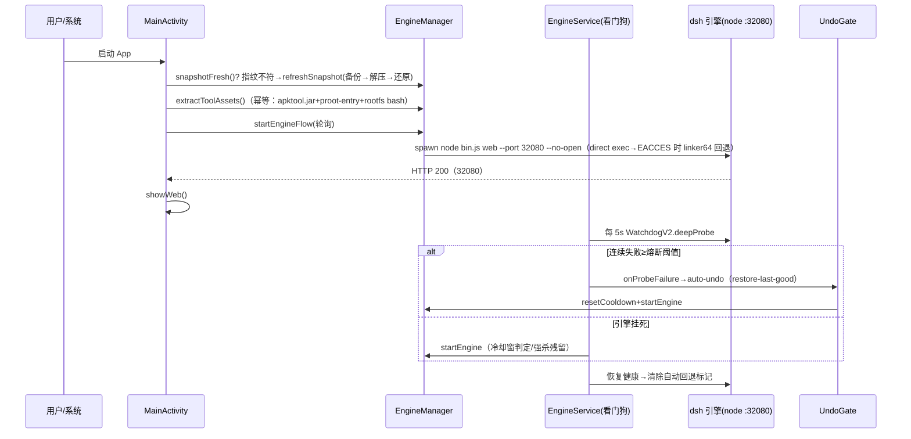
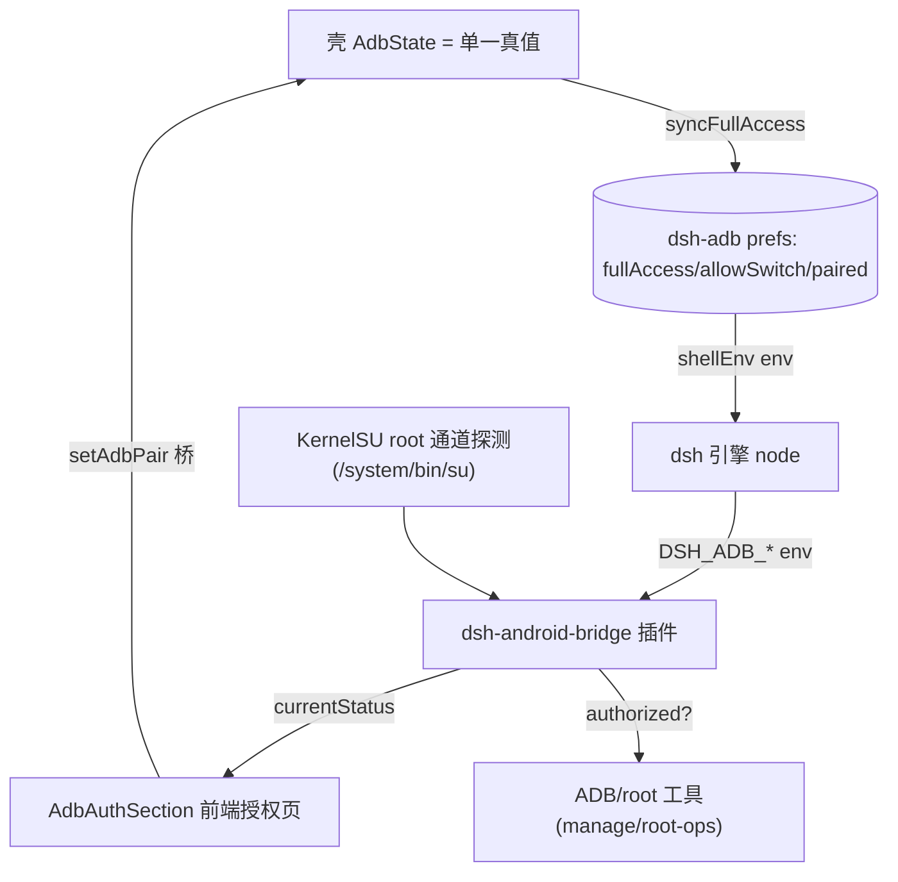

# 架构文档

## 概述

Seagull DevStudio（`com.dsharnessmobile.shell`，versionName 0.13.2-seagull，arm64-only）是 DeepSeek Harness（dsh）在 Android 上的壳应用 fork，品牌定位为「海鸥」全栈开发助手。一个 APK 装完即用：内嵌 Termux 运行时快照（node + bash + coreutils + dsh 引擎 + cordis 插件），解压后由 Android 壳拉起 dsh web 引擎（监听 `127.0.0.1:32080`），WebView 承载引擎 UI；引擎内的 agent 通过快照内 bash 真实执行命令，并通过壳注入的 ADB / KernelSU root 通道与内置工具集获得设备管理能力。

它使手机用户能够拥有一个自带完整 Ubuntu PRoot 容器（apktool/jadx/radare2/rizin 等逆向与构建工具链）的移动开发环境，engine 侧插件把「文件直达、通知、授权、悬浮球、终端输入法、Ubuntu 容器执行」等安卓平台能力暴露给 agent。

关键架构特征：平台能力全部收敛在 Android 壳（Kotlin）与 cordis 插件两层，快照内的 dsh 引擎保持上游只读、以补丁/装配适配；运行时用户数据全在应用私有域；fork 将引擎端口从上游 3080 迁移至 32080 以同机共存。

## 技术栈

**语言与运行时**
- Kotlin 2.0.21（Android 壳，minSdk 26 / targetSdk 34 / compileSdk 36）
- Java 17（AGP/JVM 目标）
- TypeScript / JavaScript（插件、前端注入层、构建脚本）
- Python 3（注入与门禁脚本）
- PowerShell（Windows 本地构建链）
- 内嵌 Linux 运行时：快照内 node + bash + proot（Android ELF 经 termux-exec LD_PRELOAD 重路由）

**框架**
- AndroidX（activity-ktx 1.10.1 / core-ktx 1.15.0）、commons-compress 1.28、xz 1.10
- AGP 8.8.2 / Gradle wrapper 8.11.1（8.11.1 见 gradle-wrapper.properties 核对）
- cordis 4.0.1（引擎插件框架，内嵌于快照 dsh 依赖）
- tsdown / tsc（插件与前端注入层构建）

**数据存储**
- 快照解压落点：`files/usr`（运行时 rootfs）、`files/home`（HOME）
- 引擎数据：`files/home/.dsh`（会话/storages/attachments/settings.yaml/凭据/undo 快照/ubuntu-rootfs）
- 共享导出：`Documents/dshdata`（exports/、log/、diagnostics/；.nomedia）
- 授权状态：`dsh-adb` SharedPreferences（live prefs：fullAccess/allowSwitch/paired/port）

**基础设施**
- CI：GitHub Actions（.github/workflows/build-apk.yml 云端从源重建；build-snapshot.yml；pr-gate.yml）
- 发布/底座托管：GitHub Releases（上游 `kelai141/dsh-mobile-apk` 底座与官方快照，构建时 curl 直连下载）
- 设备运行时：ADB（无线调试 SPAKE2 pair + NSD 端口发现 + 内置 adb server）与 KernelSU root

**外部服务**
- LLM provider：deepseek-official（壳私有文件注入 `DEEPSEEK_API_KEY`）与 dashscope/Qwen-VL（`DASHSCOPE_API_KEY`，视需要）
- 内置市场插件拉取（dshmarketplace-plugin，npm/pnpm）

## 项目结构

```
.
├── app/src/main/
│   ├── java/com/dshmobile/shell/   # Android 壳层（Kotlin，~22 文件）
│   ├── assets/                      # snapshot.tar.xz(+sha256)、patched/*（运行时补丁）、
│   │                                # undo-emergency.mjs、console.html、licenses/
│   │                                # 构建时注入 tools/（apktool/jadx/radare2/rizin）与 ubuntu-rootfs.tar.xz
│   └── res/                         # 字符串/主题（app_name=Seagull DevStudio）
├── plugins/dsh-android-{seagull,root-ops,dev-tools,apk-tools,tool-installer,bridge,manage,linux-env,file-open}/
│                                      # Seagull 5 纯 JS + 上游 4 TS 插件（src/ → lib/ 构建）
├── dsh-shell-termux/                # bash 执行器插件（TS）
├── dsh-client-ui-responsive/        # 移动 UI 注入层（React/tsdown，含测试）
├── dsh-host-web-compat/             # 页面注入/目录选择器 host（TS）
├── vendor/{dsh-undo-savepoint,dshmarketplace-plugin}  # 固化第三方插件
├── presets/seagull-root/            # 海鸥 persona/系统提示源稿
├── scripts/                         # 构建链（快照/注入/门禁/打包/CI 编排）
├── base/                            # 构建输入底座（LFS 指针，CI 从上游直连下载）
├── .github/workflows/               # build-apk / build-snapshot / pr-gate
└── docs/                            # 项目文档（design.md、RELEASE.md、HANDOVER）
```

## 子系统

### Android 壳层（app/src/main）
**目的**: 平台权能与桥的唯一宿主：快照解压、引擎进程生命周期、WebView UI、前台服务/看门狗、授权、通知、悬浮球、IME。
**位置**: `app/src/main/java/com/dshmobile/shell/`
**关键文件**: `EngineManager.kt`（解压+指纹+环境+进程）、`MainActivity.kt`（桥接线+引导+导出）、`AdbState.kt`（授权真值+adb 通道）、`EngineService.kt`/`WatchdogV2.kt`/`UndoGate.kt`（保活+熔断+自动回退）、`AndroidBridge.kt`（JS 桥）、`OverlayService.kt`（悬浮球）、`AdbKeyboardService.kt`（IME）。
**依赖**: 快照（node/bash）、assets 工具资产。
**被依赖**: 引擎经 env 读取授权/密钥；页面经 `window.androidBridge` 调用。

### 运行时快照与引擎
**目的**: 自包含 Termux rootfs + dsh 引擎。
**位置**: `assets/snapshot.tar.xz`（构建产物，不入库）→ `files/usr` + `files/home`；引擎监听 `32080`。
**关键文件**: `EngineManager.shellEnv()`（LD_PRELOAD/OPENSSL_CONF/PATH/密钥注入）、`SnapshotExtractor.kt`、`EngineProbe.kt`。
**依赖**: assets/patched 运行时补丁。
**被依赖**: 壳的探活/看门狗/控制台/UndoGate/ADB 均用快照内二进制。

### Cordis 插件装配层
**目的**: 把引擎能力（bash/文件/授权/UI/市场/undo）装配进 profile。
**位置**: `scripts/profile-web.cordis.patch.yml`（权威装配清单）+ `plugins/`、`vendor/`。
**关键文件**: patch yml、`inject-snapshot.py`（按目录名注入 lib/）、`build-apk.mjs`（编排）。
**依赖**: 快照 node_modules 存在 `@dsh-android/*` 落点。
**被依赖**: 引擎启动加载装配清单。

### 构建链与 CI
**目的**: 快照从源重建 → 插件构建 → 注入 → 门禁 → gradle 打包；自包含云端。
**位置**: `scripts/*.mjs|py|sh|ps1` + `.github/workflows/build-apk.yml`。
**关键文件**: `build-snapshot-013.mjs`、`build-apk.mjs`、`inject-snapshot.py`、`update-snapshot-patch.py`、门禁脚本集、CI yml。
**依赖**: Termux 源/上游 Release（下载底座与官方资产）。
**被依赖**: 所有发布产物的源头。

### 前端注入层（WebView 内）
**目的**: 移动 UI 响应式、深色主题、开发者设置、目录选择流程。
**位置**: `dsh-client-ui-responsive/src/client/`、`dsh-host-web-compat/lib/`、`plugins/dsh-android-bridge/src/client/`。
**关键文件**: AppFrame/DevSection/AdbAuthSection（前端授权页）。
**依赖**: `window.androidBridge` 与引擎 slot 注入。
**被依赖**: 引擎 Web UI（用户操作面）。

## 图：系统架构



## 图：引擎启动与故障回退时序



## 图：授权模型（数据流）



## 关键设计决策

1. **引擎端口 3080→32080**：fork 需与同机既装的上游 dsh-mobile 引擎并存，否则双引擎抢 3080。单点常量 `EngineProbe.ENGINE_PORT/ENGINE_URL`，探活/启动/WebView/文件直达/悬浮球 RPC 全部引用常量（fork 迁移项，检查时注意残留 3080 引用即回归点）。
2. **App-data ELF 直 exec 被拒 → linker64 回退**：Android 对 app 域 exec 的限制（targetSdk 35+/Android 16），壳统一「direct exec，Permission denied 则经 `/system/bin/linker64` 加载」（引擎/紧急 CLI/ADB 三处同一机制），termux-exec LD_PRELOAD `TERMUX_EXEC__SYSTEM_LINKER_EXEC__MODE=force` 兜底 agent 工具子进程。
3. **运行时数据全私有 + 公共目录仅导出**：DSH_HOME 恒在 `files/home/.dsh`（FUSE 禁符号链接，公共目录无法维持 node_modules 扁平回退）；`Documents/dshdata` 只放导出物/日志/诊断，`.nomedia` 防扫描。反向迁移逻辑在 `EngineManager.reverseMigrate`。
4. **授权 live prefs 单一事实源**：门 1（All Files Access）由壳 `AdbState.syncFullAccess` 写 prefs，引擎侧桥插件 live 读，`shellEnv` 里 `DSH_ADB_FULLACCESS` 仅兜底；KernelSU root 通道存在即视为已授权（root-ops 探测），设置页显示「已就绪（root 通道）」并隐藏配对表单。
5. **cordis 装配权威文件 + 注入集⊇装配集门禁**：快照内 cordis.patch.yml 由 `profile-web.cordis.patch.yml` 权威覆盖；`check-patch-mounts.mjs` 保证挂载集 ⊇ 注入集，缺装配即拒发（避免插件"注入了但引擎不加载"的历史缺陷）。
6. **快照/工具资产二进制不入库**：snapshot.tar.xz、ubuntu-rootfs.tar.xz、tools/*（大文件）由 CI 构建时从上游/官方 Release 下载落位（.gitignore），base/ 底座是 LFS 指针，CI 从上游 media 直连下载真实归档。
