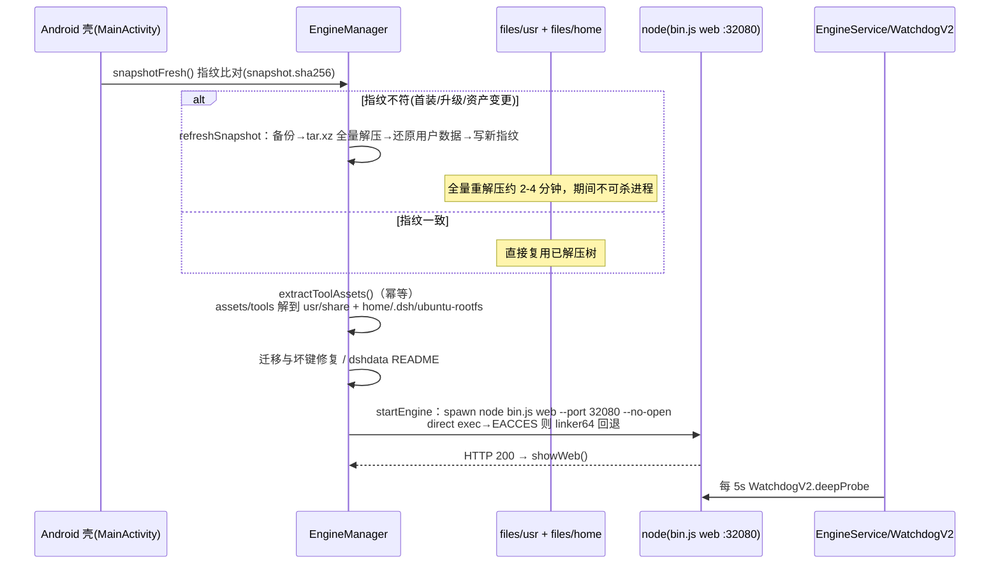

# 运行时快照与启动生命周期

Seagull DevStudio 采用「内嵌 Linux 运行时快照 + 冷启动解压」模型：APK 内自带一个完整的 Termux rootfs（`assets/snapshot.tar.xz`），装完首启解压到应用私有域 `files/usr`（rootfs）与 `files/home`（HOME），再由 Android 壳直接 exec 快照内的 node 拉起 dsh web 引擎。应用不依赖系统安装任何运行时。

## 快照内容（构建期确定）

- Termux 用户态：`node`、`bash`、coreutils、`proot`（Ubuntu 容器命根，0.13.2-seagull 起进 TARGETS）、apt/dpkg 工具链、adb、pnpm 等。
- dsh 引擎：`@deepseek-ai/dsh`（基线 0.13.x）`bin.js web` 入口，监听 `127.0.0.1:32080`。
- cordis 装配清单：快照内 `cordis.patch.yml` 被构建期 `profile-web.cordis.patch.yml` 权威覆盖。
- `@dsh-android/*` 插件集：Seagull 5 纯 JS（seagull/root-ops/dev-tools/apk-tools/tool-installer）+ 上游桥（bridge/manage/linux-env/file-open）+ 执行器/注入层（shell-termux/ui-responsive/host-web-compat）+ 固化第三方（undo-savepoint/marketplace/attachment-formats/directory-picker 等）。
- licenses：`usr/share/doc` 的版权、`usr/share/LICENSES` 全文族、`licenses` 包。

快照为构建产物，不入库（.gitignore）。`base/` 目录存放底座 `base-usr-arm64.tar.xz` 等 LFS 指针，CI 构建从上游 Release 直连下载真实归档。

## 解压与启动生命周期

关键代码点：`EngineManager.kt` 的 `snapshotFresh/refreshSnapshot/extractToolAssets/shellEnv/startEngine`；`SnapshotExtractor.kt`（tar 解压 + zip-slip 防护）；`EngineProbe.kt`（`ENGINE_PORT=32080`、`ENGINE_URL` 单点常量）。

## 启动锁与并发

引擎启动串行化：同一时刻只允许一个 `startEngineFlow` 实例（并发锁），避免双引擎竞争 32080；残留引擎（含 linker64 回退链的孤儿子进程，`force-stop` 杀不死）在启动前按进程存活判定清理。

## 看门狗与崩溃回退

`EngineService`（前台服务）内 `WatchdogV2` 每 5s 探活；连续失败达熔断阈值触发 `UndoGate` 自动回退：以 `undo-emergency.mjs` 急救 CLI（`restore-last-good`）把 dsh 会话/配置回退到最近良好快照，幂等标记 `.undo-auto-done` 防循环回退。`OPENSSL_CONF` 注入对 CLI 正确性必不可少（快照 node 编译期 cnf 路径不可读）。

## 环境注入（engine shellEnv）

`EngineManager.shellEnv()` 统一注入子进程环境：`PATH`/`LD_LIBRARY_PATH`/`HOME`/`DSH_HOME`/`TMPDIR`、`LD_PRELOAD=libtermux-exec-ld-preload.so`（ELF 重路由，`TERMUX_EXEC__SYSTEM_LINKER_EXEC__MODE=force`）、`OPENSSL_CONF=<usr>/etc/tls/openssl.cnf`、`SSL_CERT_FILE`、授权 env（`DSH_ADB_*`）与密钥注入（`DEEPSEEK_API_KEY`/`DASHSCOPE_API_KEY` 来自私有文件，非源码）。

## 指纹与资产 ABI

- 快照 `snapshot.tar.xz` + `snapshot.sha256` 必须成对替换；指纹变化触发全量重解压。
- debug 包默认带 x86_64 快照；本 fork 收敛 arm64-only，`abiFilters arm64-v8a`。核对方法：解快照 tar 读 `usr/bin/node` 的 ELF e_machine（183=arm64 / 62=x86_64），或 `aapt dump badging` 看 native-code。
